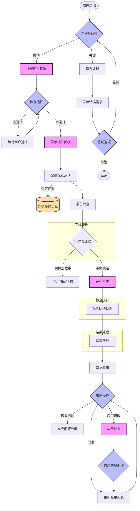
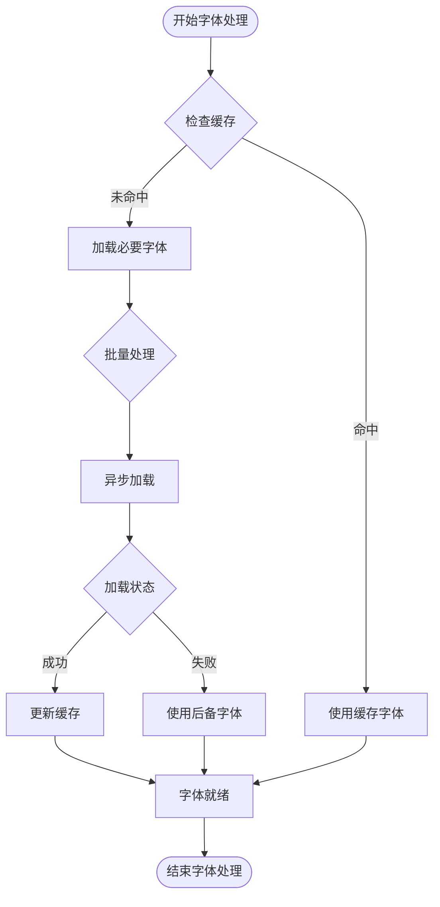
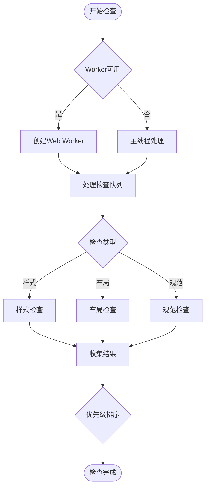
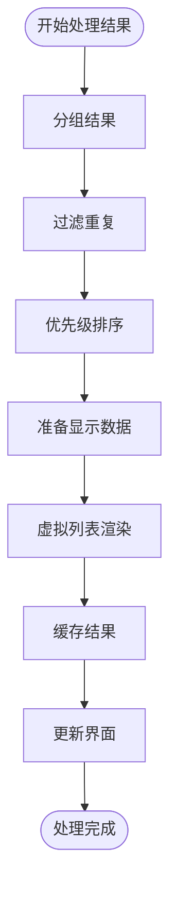

# Figma UI Review Plugin 流程设计文档

## 1. 概述
本文档详细描述了Figma UI Review Plugin的完整工作流程，包括主流程和关键子流程。该插件旨在提供高效的UI审查功能，支持样式检查、布局规范验证等功能。

## 2. 主流程
主流程图描述了插件的核心工作流程，从启动到结果处理的完整过程。

## 3. 字体管理子流程
字体管理子流程负责处理字体加载、缓存和降级策略。

## 4. 检查执行子流程
检查执行子流程描述了具体的检查任务执行过程。

## 5. 结果处理子流程
结果处理子流程负责对检查结果进行处理和展示。

## 6. 技术实现要点

### 6.1 性能优化
- 使用Web Worker处理复杂计算
- 实现字体缓存机制
- 采用虚拟列表展示大量结果
- 批量处理检查任务

### 6.2 错误处理
- 完整的错误捕获机制
- 优雅的降级策略
- 用户友好的错误提示
- 重试机制

### 6.3 用户体验
- 实时反馈
- 进度指示
- 操作引导
- 快捷键支持

### 6.4 数据管理
- 设置持久化
- 检查结果缓存
- 状态管理
- 撤销/重做支持

## 7. 注意事项
1. 确保所有异步操作都有适当的状态指示
2. 实现合理的内存管理策略
3. 注意处理大型文档的性能问题
4. 保持用户界面的响应性